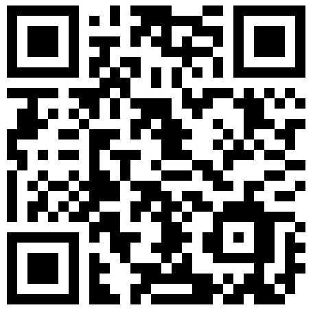
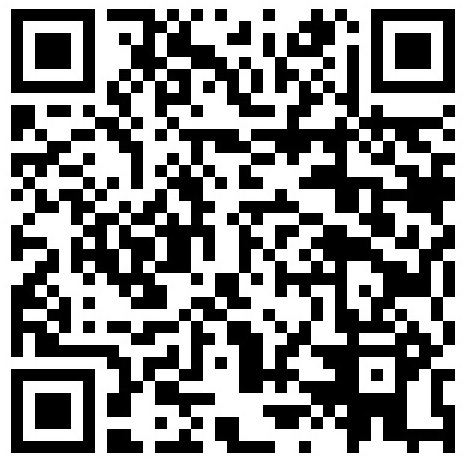
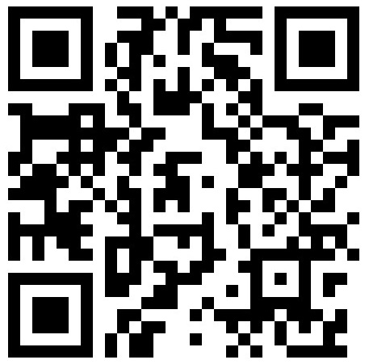

# Tidev

Tidev app - Make your jobs easier !

Tidev is a versatile software that supports control, system optimization, and quick installation on Windows 10.

The software is currently being used by a small number of partners and customers through a license to use (copyright) and is NOT recommended for customers who do not know about Tidev or do not have a license to use it. We refuse to deal with any unfortunate problems caused by the software if you do not have a license to use it.

# Function
- Save time: Some settings on your computer are optimized with just a few simple steps.
- System optimization: Some system features or other software are rarely used but make your computer slow. Tidev will solve this problem.
- Utilities & personalization: The software is also integrated with a number of utilities to support your work. In addition, you can completely personalize the software's features if you like.

# Download

 [Download installer for Windows 10](https://raw.githubusercontent.com/khathiatz/tidev/master/Tidev%20Installer.exe)

# About

Tidev is programmed and directly managed by Kha Thi Nguyen.

Address: Ben Tre, Vietnam.

Email: khathinkt@icloud.com

https://tidevapp.wordpress.com

# Donation

[1] Choose the donation method that suits you and make the transfer:

*(Bạn hãy chọn một phương thức quyên góp phù hợp với mình, sau đó thực hiện chuyển khoảng)*

-  Binance Pay ID: [89804319](https://www.binance.com)
  
  
  
  
-  Bitcoin (BTC): [16Bxc25RqGk5u8FNtbZD96roivrwz3eD3T](https://www.blockchain.com/btc/address/16Bxc25RqGk5u8FNtbZD96roivrwz3eD3T)

  

-  Monero (XMR): [89MisttjRrv9oPmVedVdGNFkHPvgR7ngQc3eJzS6Fo1rZE4PinqxTFSFkaoAHjpaMJUqtPPwoP8wP4AcDLwWQNS68LHLikE](https://xmrchain.net/search?value=89MisttjRrv9oPmVedVdGNFkHPvgR7ngQc3eJzS6Fo1rZE4PinqxTFSFkaoAHjpaMJUqtPPwoP8wP4AcDLwWQNS68LHLikE)

  

-  Stellar Lumens (XLM): [GAHK7EEG2WWHVKDNT4CEQFZGKF2LGDSW2IVM4S5DP42RBW3K6BTODB4A](https://stellarchain.io/address/GAHK7EEG2WWHVKDNT4CEQFZGKF2LGDSW2IVM4S5DP42RBW3K6BTODB4A)  MEMO: [477508745](/) (recommended, low fees)

  

[2] After the transfer, save the transfer proof information such as the transfer photo or the hash number. Next, send that information to email [khathinkt@icloud.com](mailto:khathinkt@icloud.com) with the subject line "Donate Tidev". We will check and return you Tidev PRO activation license with any donation as a thank you. With donation ≥20USD You can also request sample Autoit API source code of AirVisual, Binance, Dropbox, Github, Open Weather Map, Telegram.

*(Sau khi chuyển khoảng, bạn hãy lưu lại thông tin chứng minh chuyển khoảng như ảnh chụp chuyển tiền hoặc số hash. Tiếp theo, gửi thông tin đó đến email [khathinkt@icloud.com](mailto:khathinkt@icloud.com) với tiêu đề "Donate Tidev". Chúng tôi sẽ kiểm tra và gửi trả bạn giấy phép kích hoạt Tidev PRO với bất kỳ mức quyên góp nào như lời cảm ơn. Với mức quyên góp ≥20USD Bạn cũng có thể yêu cầu mã nguồn Autoit API mẫu của AirVisual, Binance, Dropbox, Github, Open Weather Map, Telegram.)*

Thank you!
